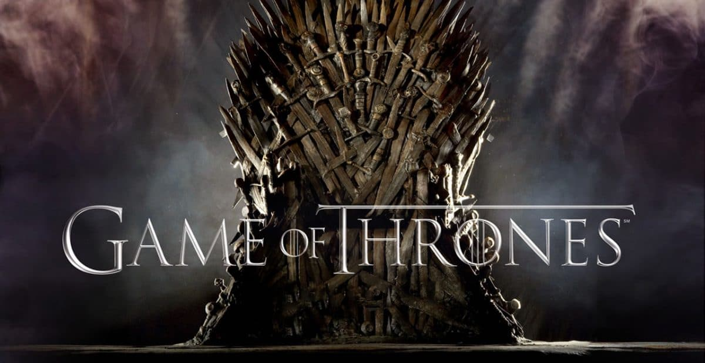

# app-dev
My first repository.

---

# Game of Thrones

### In the mythical continent of Westeros, several powerful families fight for control of the Seven Kingdoms. As conflict erupts in the kingdoms of men, an ancient enemy rises once again to threaten them all. Meanwhile, the last heirs of a recently usurped dynasty plot to take back their homeland from across the Narrow Sea. —Sam Gray (IMDb)

---

### Genre
-	Action
- Adventure
- Fantasy
- Serial drama
- Tragedy

### Stars
- Emilia Clark
- Peter Dinklage
- Kit Harington

### Created by
- David Benioff & D. B. Weiss

### Based on
- *A Song of Ice and Fire* by George R. R. Martin

### Release
- April 17, 2011 – May 19, 2019

---

***Game of Thrones* adaptation and season schedule**
| Season | Aired | Novel(s) adapted |
| --- | --- | --- |
| Season 1 | April 17, 2011 - June 19, 2011 | *A Game of Thrones* |
| Season 2 | April 1, 2012 - June 3, 2012 | *A Clash of Kings* |
| Season 3 | March 31, 2013 - June 9, 2013 | *A Storm of Swords* |
| Season 4 | April 6, 2014 - June 15, 2014 | *A Storm of Swords* |
| Season 5 | April 12, 2015 - June 14, 2015 | *A Feast for Crows, A Dance with Dragons* and original content |
| Season 6 | April 24, 2016 - June 26, 2016 | Outline from *The Winds of Winter* and original content |
| Season 7 | July 16, 2017 - August 27, 2017 | Outline from  *A Dream of Spring* and original content |
| Season 8 | April 14, 2019 - May 19, 2019 | Outline from  *A Dream of Spring* and original content |

---
*Information above are retrieved from [Wikipedia](https://en.wikipedia.org/wiki/Game_of_Thrones), [Game of Thrones Fandom](https://gameofthrones.fandom.com/wiki/Game_of_Thrones), and [IMDb](https://www.imdb.com/title/tt0944947/?ref_=ttfc_fc_tt)*.
